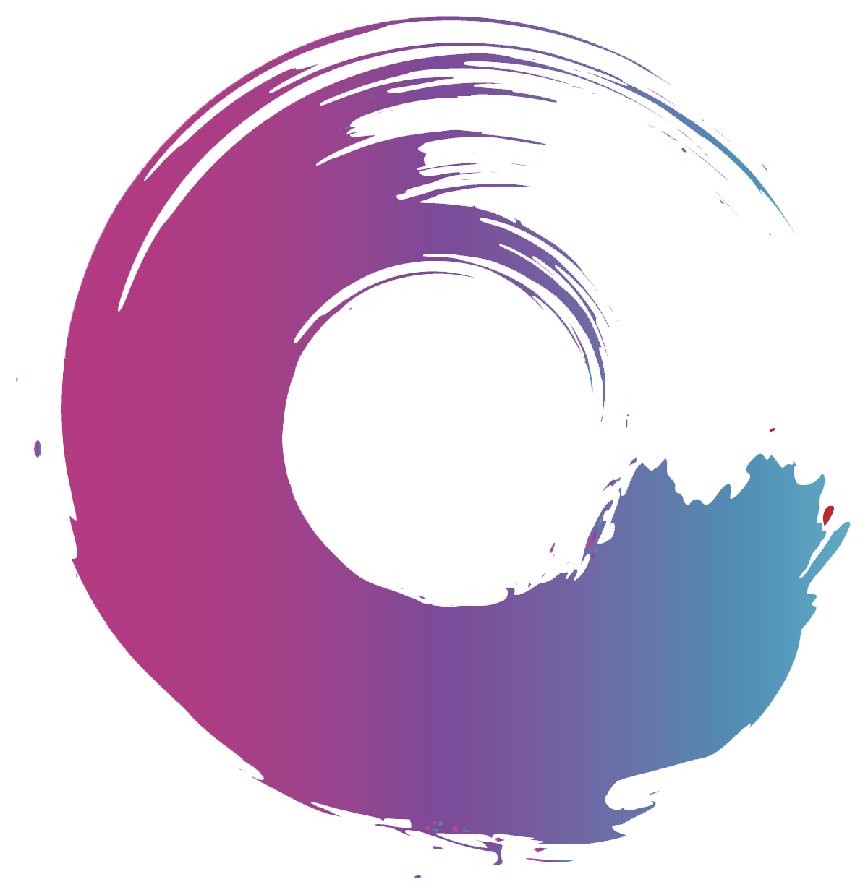

# B-DARK CHAT WEB & APP

>### MongoDb
---
- User 
    * have userID, username, email, password, profilePics  
- Message
    * send messages between Member
- ConnectID
    * connect ID member in room them by memberID 
- ~~Live A7A Stream: live stream 3lshan yshof خلقتك~~
___
>### Socket.IO
---
- Connect with 2 user

___
>### Multer
---
- use to upload Pics or videos
___
>### Bcrypt
---
- Hash password
___
>### Icon
---



>## DATA
### Table
---
|ID| username |userPhone|
|--|----------|---------|
|56|moahmed mostafa|01142314446|
|57|Ahmed nour|010800000008|
|58|mostafa abbas|0112233445566|
---
## #JSON CODE
```javascript
[

    {

        "username": "moahmed mostafa",
        "userPhone" : "01142314446",
    },
    {
        "username": "Ahmed nour",
        "userPhone" : "010800000008",
    },
    {
        "username": "mostafa abbas",
        "userPhone" : "0112233445566",
    }

]
```
